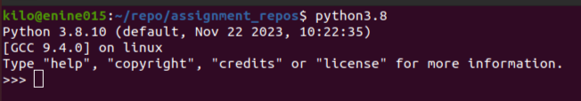

# Python Interpreter

Python Interpreter actually excutes our python code line by line. It is built on _C-Language_ and executes code without compiling it. This makes it very fast and lightweight.

It is usually located on `/usr/local/bin/python3.8` path.

We can directly invoke it by typing following code in command shell:

```
python3.8
```
>[!CAUTION]
> All of the code blocks are written with repect to unix operating system and not for Windows operating systems.

After invoking the interpreter an interactive shell will open like this :



You can exit the interpreter by using `exit()` or `quit()`.

